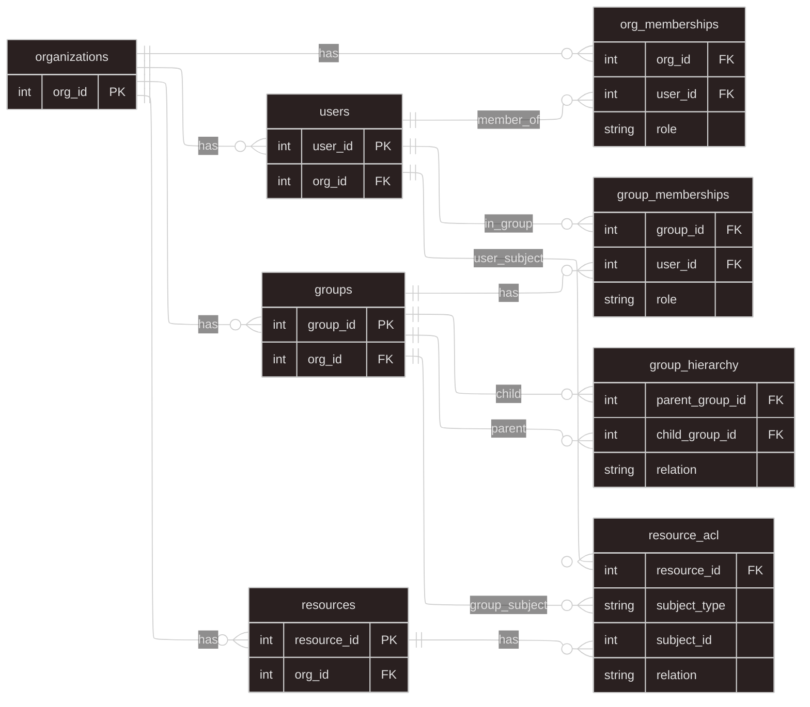
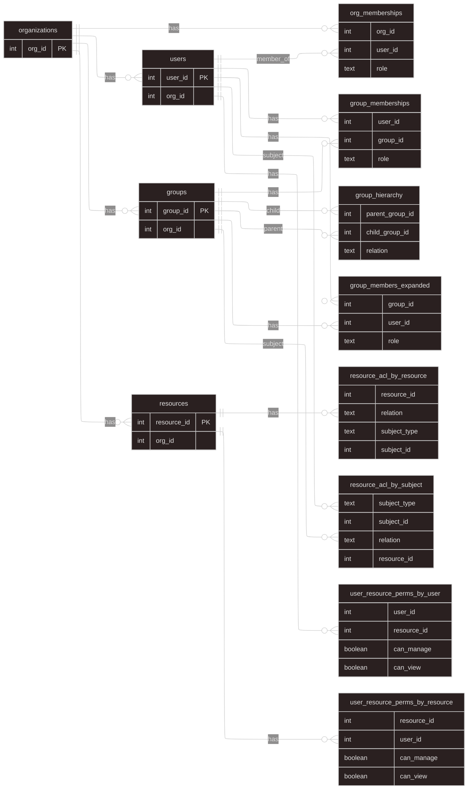
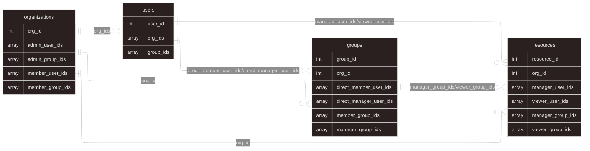
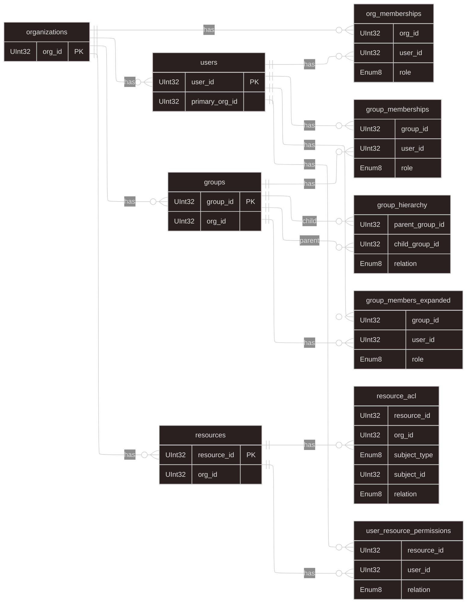
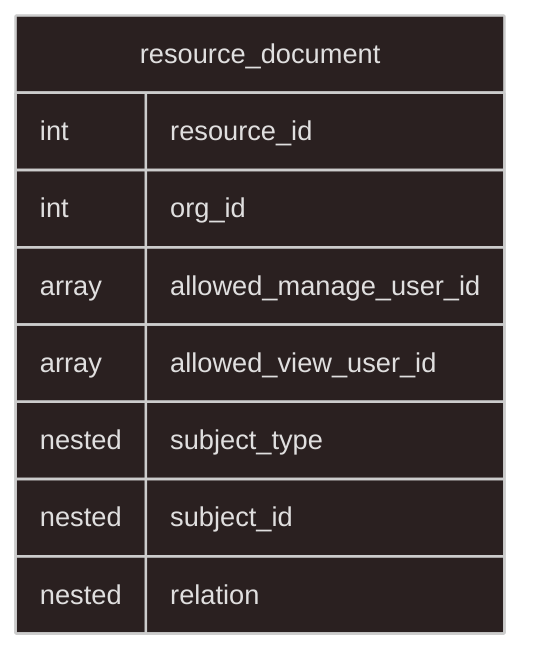

# Row-Level Permission Benchmark – Formal Schema Compendium

This document provides a formally structured, engine‑specific description of the eight distinct schema implementations used in the Row‑Level Permission (RLP) benchmark. Each database engine projects the same logical CSV source model into a physical form optimized for its execution characteristics. Diagrams are rendered in Mermaid. For relational / tabular engines and document stores, `erDiagram` is used; for Authzed (graph / relationship model) `flowchart` is used. Each diagram embeds index (or equivalent optimization) metadata as pseudo‑attributes prefixed with `index:` (or `projection:` / `mv:` where applicable).

The logical source dataset (CSV) comprises: organizations, users, groups, group hierarchy, organization memberships, group memberships, resources, resource ACL, and derived permission closures. Engines differ mainly in their handling of denormalization, transitive expansion, and permission closure materialization.

---

## 1. PostgreSQL Schema
Source: `cmd/postgres/schemas.sql`

Features: Fully normalized core entities, Zanzibar‑style ACL edge table, recursive materialized view (`user_resource_permissions`) for nested groups and group role propagation, comprehensive B‑tree indexing for common access patterns.

### 1.1. Entity

### 1.2 Functions

| Field              | Summary                                                                               |
| ------------------ | ------------------------------------------------------------------------------------- |
| Function Name      | `refresh_user_resource_permissions`                                                   |
| Return Type        | `void`                                                                                |
| Language           | `plpgsql`                                                                             |
| Main Operation     | `REFRESH MATERIALIZED VIEW user_resource_permissions`                                 |
| Purpose            | Recompute and reload all data inside the materialized view so it reflects latest data |
| Affected Object    | `user_resource_permissions` (materialized view)                                       |
| Behavior           | Performs a full rebuild of MV from source tables                                      |
| Locking            | Requires **ACCESS EXCLUSIVE** lock on the MV (blocks reads/writes during refresh)     |
| When to Use        | After changes in ACL, groups, memberships, hierarchy, or resources                    |
| Trigger / Auto-run | No automatic refresh; must be invoked manually or via scheduler                       |

### 1.3 Indexes

| No | Index Name                            | Table                          | Columns                                         |
| -- | ------------------------------------- | ------------------------------ | ----------------------------------------------- |
| 1  | idx_org_memberships_user              | org_memberships                | user_id, org_id, role                           |
| 2  | idx_group_memberships_user            | group_memberships              | user_id, group_id, role                         |
| 3  | idx_resources_org                     | resources                      | org_id, resource_id                             |
| 4  | idx_resource_acl_by_resource_subject  | resource_acl                   | resource_id, subject_type, subject_id, relation |
| 5  | idx_resource_acl_by_subject           | resource_acl                   | subject_type, subject_id, relation, resource_id |
| 6  | idx_resource_acl_res_rel_type_subject | resource_acl                   | resource_id, relation, subject_type, subject_id |
| 7  | idx_users_org                         | users                          | org_id                                          |
| 8  | uq_user_resource_permissions          | user_resource_permissions (MV) | resource_id, user_id, relation                  |
| 9  | idx_urp_user_rel_res                  | user_resource_permissions      | user_id, relation, resource_id                  |
| 10 | idx_urp_org_user_rel                  | user_resource_permissions      | org_id, user_id, relation, resource_id          |
| 11 | idx_group_hierarchy_parent            | group_hierarchy                | parent_group_id, relation, child_group_id       |
| 12 | idx_group_hierarchy_child             | group_hierarchy                | child_group_id, relation, parent_group_id       |
| 13 | pk_org_memberships                    | org_memberships                | org_id, user_id                                 |
| 14 | pk_group_memberships                  | group_memberships              | group_id, user_id                               |
| 15 | pk_group_hierarchy                    | group_hierarchy                | parent_group_id, child_group_id, relation       |
| 16 | pk_resource_acl                       | resource_acl                   | resource_id, subject_type, subject_id, relation |

### 1.4. Materialized View

#### 1.4.1. `user_resource_permissions`
| Final Field (Output MV) | Source Expression                                                        | Operation / Transformation          | Real Table(s) Used                                  | Explanation                                                 |
| ----------------------- | ------------------------------------------------------------------------ | ----------------------------------- | --------------------------------------------------- | ----------------------------------------------------------- |
| **resource_id**         | `r.resource_id`                                                          | Direct selection                    | `resources` (joined via `resource_acl.resource_id`) | Resource identifier from the `resources` table.             |
| **org_id**              | `r.org_id`                                                               | Direct selection                    | `resources`                                         | Organization ownership of the resource.                     |
| **user_id**             | `ra.subject_id` (case 1)                                                 | Direct extraction                   | `resource_acl`                                      | When ACL is assigned directly to a user.                    |
|                         | `mu.user_id` (case 2)                                                    | Recursive group → manager expansion | `group_memberships`, `group_hierarchy`              | User resolved as an effective manager in the group ACL.     |
|                         | `mem.user_id` (case 3)                                                   | Recursive group → member expansion  | `group_memberships`, `group_hierarchy`              | User resolved as an effective member (including managers).  |
| **relation**            | `CASE WHEN ra.relation LIKE 'manager%' THEN 'manager' ELSE 'viewer' END` | Normalize ACL role                  | `resource_acl`                                      | Direct user ACL mapped to either `"manager"` or `"viewer"`. |
|                         | `'manager'` (case 2)                                                     | Literal constant                    | N/A                                                 | Group-manager ACL always yields `"manager"`.                |
|                         | `'viewer'` (case 3)                                                      | Literal constant                    | N/A                                                 | Group-viewer ACL always yields `"viewer"`.                  |

---

## 2. CockroachDB Schema
Source: `cmd/cockroachdb/schemas.sql`

Features: Mirrors PostgreSQL normalization and MV strategy. Uses recursive CTE to build `user_resource_permissions` MV. No `plpgsql` function; MV must be manual refreshed via `REFRESH MATERIALIZED VIEW` statements. Indexes align with PostgreSQL for identical access paths.

---

## 3. ScyllaDB Schema
Sources: `cmd/scylladb/schemas.cql`

Features: Denormalized, partition‑first modeling for locality. Dual ACL tables (`resource_acl_by_resource`, `resource_acl_by_subject`) and precomputed closure tables (`group_members_expanded`, `user_resource_perms_by_*`) optimize read paths. Secondary indexes are added only where valid (single‑column) and beneficial.

### 3.1. Entity

### 3.2 Functions

| Field           | Summary                                                |
| ----------------| ------------------------------------------------------ |
| Function Name   | N/A                                                    |
| Purpose         | Not applicable; ScyllaDB does not use SQL functions    |
| Trigger / Auto  | N/A                                                    |

### 3.3 Indexes

| No | Index Name                      | Table                         | Columns                                             |
| -- | --------------------------------| ----------------------------- | --------------------------------------------------- |
| 1  | idx_group_members_expanded_user | group_members_expanded        | user_id                                             |
| 2  | idx_group_hierarchy_child       | group_hierarchy               | child_group_id                                      |
| 3  | pk_org_memberships              | org_memberships               | org_id, user_id, role                               |
| 4  | pk_group_memberships            | group_memberships             | user_id, group_id, role                             |
| 5  | pk_group_hierarchy              | group_hierarchy               | parent_group_id, child_group_id, relation           |
| 6  | pk_group_members_expanded       | group_members_expanded        | group_id, user_id, role                             |
| 7  | pk_resource_acl_by_resource     | resource_acl_by_resource      | resource_id, relation, subject_type, subject_id     |
| 8  | pk_resource_acl_by_subject      | resource_acl_by_subject       | subject_type, subject_id, relation, resource_id     |
| 9  | pk_user_resource_perms_by_user  | user_resource_perms_by_user   | user_id, resource_id                                |
| 10 | pk_user_resource_perms_by_res   | user_resource_perms_by_resource| resource_id, user_id                                |

### 3.4 Compiled Permission Tables (Closure)

| Output Table                      | Final Field            | Source Expression                                     | Operation / Transformation               | Real Table(s) Used                      | Explanation                                         |
| --------------------------------- | ---------------------- | ----------------------------------------------------- | ---------------------------------------- | --------------------------------------- | --------------------------------------------------- |
| user_resource_perms_by_user       | resource_id            | `ra.resource_id`                                      | Direct selection                         | resource_acl_by_resource                | Resource from ACL edges per user                    |
|                                   | user_id                | `ra.subject_id` (user) / `gme.user_id` (group expand) | Expand group → member/manager via closure | group_members_expanded                  | Effective user resolved from group ACL              |
|                                   | can_manage             | derived from relations (`manager_user`, `manager_group`) | Boolean flag aggregation                | resource_acl_by_* + group_members_expanded | TRUE if manager relation applies                 |
|                                   | can_view               | derived from relations (`viewer_user`, `viewer_group`)  | Boolean flag aggregation                | resource_acl_by_* + group_members_expanded | TRUE if viewer relation applies                  |
| user_resource_perms_by_resource   | resource_id            | `ra.resource_id`                                      | Direct selection                         | resource_acl_by_resource                | Resource perspective (inverted index)               |
|                                   | user_id                | `ra.subject_id` / `gme.user_id`                       | Expand group → member/manager via closure | group_members_expanded                  | Effective user resolved from group ACL              |
|                                   | can_manage             | derived from relations                                 | Boolean flag aggregation                 | resource_acl_by_* + group_members_expanded | TRUE if manager relation applies                  |
|                                   | can_view               | derived from relations                                 | Boolean flag aggregation                 | resource_acl_by_* + group_members_expanded | TRUE if viewer relation applies                   |

---

## 4. MongoDB Schema
Source: `cmd/mongodb/create_schemas.go`

Features: Document‑centric with embedded permission closures in `resources`. Uses multikey indexes on arrays and compound indexes on org‑scoped queries to accelerate membership and ACL expansion.

### 4.1. Collections

### 4.2 Indexes

| No | Index Name                    | Collection  | Columns / Fields                                                  | Type        | Notes                                           |
| -- | ----------------------------- | ----------- | ----------------------------------------------------------------- | ----------- | ----------------------------------------------- |
| 1  | org_id_unique                 | organizations | org_id                                                            | UNIQUE      | Unique identifier for organization             |
| 2  | admin_user_ids_idx            | organizations | admin_user_ids                                                    | MULTIKEY    | Array index for admin users in org              |
| 3  | admin_group_ids_idx           | organizations | admin_group_ids                                                   | MULTIKEY    | Array index for admin groups in org             |
| 4  | member_user_ids_idx           | organizations | member_user_ids                                                   | MULTIKEY    | Array index for member users in org             |
| 5  | member_group_ids_idx          | organizations | member_group_ids                                                  | MULTIKEY    | Array index for member groups in org            |
| 6  | user_id_unique                | users       | user_id                                                           | UNIQUE      | Unique identifier for user                     |
| 7  | org_ids_idx                   | users       | org_ids                                                           | MULTIKEY    | Array index for user's org memberships          |
| 8  | group_ids_idx                 | users       | group_ids                                                         | MULTIKEY    | Array index for user's group memberships        |
| 9  | group_id_unique               | groups      | group_id                                                          | UNIQUE      | Unique identifier for group                    |
| 10 | org_id_idx                    | groups      | org_id                                                            | NORMAL      | Index for org-scoped group lookups              |
| 11 | direct_member_users_idx       | groups      | direct_member_user_ids                                            | MULTIKEY    | Array index for direct members in group         |
| 12 | direct_manager_users_idx      | groups      | direct_manager_user_ids                                           | MULTIKEY    | Array index for direct managers in group        |
| 13 | member_group_ids_idx          | groups      | member_group_ids                                                  | MULTIKEY    | Array index for member nested groups            |
| 14 | manager_group_ids_idx         | groups      | manager_group_ids                                                 | MULTIKEY    | Array index for manager nested groups           |
| 15 | resource_id_unique            | resources   | resource_id                                                       | UNIQUE      | Unique identifier for resource                 |
| 16 | org_id_idx                    | resources   | org_id                                                            | NORMAL      | Index for org-scoped resource lookups           |
| 17 | manager_user_ids_idx          | resources   | manager_user_ids                                                  | MULTIKEY    | Array index for user managers on resource       |
| 18 | viewer_user_ids_idx           | resources   | viewer_user_ids                                                   | MULTIKEY    | Array index for user viewers on resource        |
| 19 | manager_group_ids_idx         | resources   | manager_group_ids                                                 | MULTIKEY    | Array index for group managers on resource      |
| 20 | viewer_group_ids_idx          | resources   | viewer_group_ids                                                  | MULTIKEY    | Array index for group viewers on resource       |
| 21 | org_manage_user_idx           | resources   | org_id, manager_user_ids                                          | COMPOUND    | Org-scoped manager user lookup                  |
| 22 | org_view_user_idx             | resources   | org_id, viewer_user_ids                                           | COMPOUND    | Org-scoped viewer user lookup                   |
| 23 | org_manage_group_idx          | resources   | org_id, manager_group_ids                                         | COMPOUND    | Org-scoped manager group lookup                 |
| 24 | org_view_group_idx            | resources   | org_id, viewer_group_ids                                          | COMPOUND    | Org-scoped viewer group lookup                  |

---

## 5. ClickHouse Schema
Source: `cmd/clickhouse/schemas.sql`

Features: Columnar denormalization with `MergeTree` engines, partitions, order keys. Uses projections and specialized indexes (minmax, bloom filter). A materialized view stream populates `user_resource_permissions`.

### 5.1. Entity

### 5.2 Indexes and Projections

| No | Index / Projection Name               | Table                | Type           | Columns / Details                                               |
| -- | ------------------------------------- | -------------------- | -------------- | --------------------------------------------------------------- |
| 1  | idx_org_memberships_user              | org_memberships      | MINMAX         | user_id                                                         |
| 2  | idx_group_memberships_group           | group_memberships    | MINMAX         | group_id                                                        |
| 3  | idx_group_members_expanded_user       | group_members_expanded | MINMAX        | user_id                                                         |
| 4  | idx_resources_resource                | resources            | MINMAX         | resource_id                                                     |
| 5  | idx_resource_acl_subject_bf           | resource_acl         | BLOOM_FILTER   | subject_type, subject_id                                        |
| 6  | idx_resource_acl_resource_minmax      | resource_acl         | MINMAX         | resource_id                                                     |
| 7  | resource_acl_by_subject (projection)  | resource_acl         | PROJECTION     | org_id, subject_type, subject_id, relation, resource_id         |

### 5.3 Table Engines and Partitioning

| Table Name                | Engine    | Partition Key                    | Order Key                                           | Notes                        |
| ------------------------- | --------- | -------------------------------- | --------------------------------------------------- | ---------------------------- |
| organizations             | MergeTree | (none)                           | (org_id)                                            | —                            |
| users                     | MergeTree | (none)                           | (user_id)                                           | —                            |
| groups                    | MergeTree | org_id                           | (org_id, group_id)                                  | Partitioned by org           |
| org_memberships           | MergeTree | org_id                           | (org_id, user_id, role)                             | Partitioned by org           |
| group_memberships         | MergeTree | (none)                           | (user_id, group_id, role)                           | —                            |
| group_hierarchy           | MergeTree | (none)                           | (parent_group_id, child_group_id)                   | —                            |
| group_members_expanded    | MergeTree | (none)                           | (group_id, user_id, role)                           | Precomputed closure          |
| resources                 | MergeTree | org_id                           | (org_id, resource_id)                               | Partitioned by org           |
| resource_acl              | MergeTree | org_id                           | (org_id, resource_id, relation, subject_type, subject_id) | Partitioned by org           |
| user_resource_permissions | MergeTree | intDiv(user_id, 10000)           | (user_id, resource_id, relation)                    | Sharded partition by user ID |

### 5.4 Materialized View

#### 5.4.1. `user_resource_permissions_mv`
| Final Field (Output MV) | Source Expression                      | Operation / Transformation                 | Real Table(s) Used                                  | Explanation                                                    |
| ----------------------- | -------------------------------------- | ------------------------------------------ | --------------------------------------------------- | -------------------------------------------------------------- |
| **resource_id**         | `ra.resource_id`                       | Direct selection                           | `resource_acl`                                      | Resource from direct user ACL entry.                           |
|                         | `ra.resource_id`                       | Direct selection                           | `resource_acl` joined with `group_members_expanded` | Resource from group ACL expanded to member users.              |
|                         | `r.resource_id`                        | Direct selection                           | `resources` joined with `org_memberships`           | Org admins get automatic resource manager permission.          |
| **user_id**             | `ra.subject_id` (subject_type='user')  | Direct extraction                          | `resource_acl`                                      | User from direct ACL.                                          |
|                         | `gme.user_id` (subject_type='group')   | Expansion from group_members_expanded      | `group_members_expanded`                            | User resolved as effective group member.                       |
|                         | `om.user_id`                           | Direct selection from org_memberships      | `org_memberships`                                   | Org admin/member users.                                        |
| **relation**            | `ra.relation`                          | Direct mapping (UNION with role filter)    | `resource_acl`                                      | Direct ACL relation ('viewer' or 'manager').                   |
|                         | `ra.relation`                          | Direct mapping via UNION                   | `resource_acl` + `group_members_expanded`           | Group ACL propagated to members.                               |
|                         | `'manager'`                            | Literal constant when `role='admin'`       | N/A                                                 | Org admins always get manager permission.                      |
|                         | `'viewer'`                             | Literal constant when `role='member'`      | N/A                                                 | Org members always get viewer permission.                      |

---

## 6. Elasticsearch Schema
Source: `cmd/elasticsearch/create_schemas.go`

Features: Single index (`resources`) with nested ACL entries and flattened arrays of effective user IDs per permission tier. Elasticsearch’s inverted index provides fast term queries; nested field mapping supports ACL joins.

### 6.1. Index Mapping

### 6.2 Index Fields and Query Optimizations

| No | Field Name                   | Field Type    | Indexed | Notes                                                      |
| -- | ---------------------------- | ------------- | ------- | ---------------------------------------------------------- |
| 1  | resource_id                  | integer       | yes     | Primary key (implicit inverted index)                      |
| 2  | org_id                        | integer       | yes     | Organization ownership (implicit inverted index)           |
| 3  | allowed_manage_user_id       | integer[]     | yes     | Flattened array of user IDs with manager permission        |
| 4  | allowed_view_user_id         | integer[]     | yes     | Flattened array of user IDs with viewer permission         |
| 5  | acl.subject_type             | keyword       | yes     | Nested: 'user' or 'group' (nested inverted index)          |
| 6  | acl.subject_id               | integer       | yes     | Nested: subject identifier (nested inverted index)         |
| 7  | acl.relation                 | keyword       | yes     | Nested: 'manager_user', 'viewer_user', etc. (nested index) |

### 6.3 Query Patterns

| Query Type                                          | Method                                                              | Index Used                           |
| --------------------------------------------------- | ------------------------------------------------------------------ | ------------------------------------ |
| Check if user X can manage resource Y              | Term query on `allowed_manage_user_id`                              | Inverted index on arrays             |
| Check if user X can view resource Y                | Term query on `allowed_view_user_id`                                | Inverted index on arrays             |
| Find all resources user X can manage               | Term query filtered by user ID on `allowed_manage_user_id`          | Inverted index on arrays             |
| Find all resources user X can view                 | Term query filtered by user ID on `allowed_view_user_id`            | Inverted index on arrays             |
| Resolve group Y members with relation Z on resource R | Nested query over `acl.*` where subject_type='group' and subject_id=Y | Nested field inverted index          |

---

## 7. Authzed (PostgreSQL Backend) Graph Schema
Source: `cmd/authzed_pgdb/schemas.zed`

Features: Authorization graph with object definitions, relations, and computed permissions (Zanzibar model). Storage uses PostgreSQL internally; indexes are abstracted by SpiceDB/Authzed.

### 7.1. Objects, Relations, Permissions

---

## 8. Authzed (CockroachDB Backend) Graph Schema
Source: `cmd/authzed_crdb/schemas.zed`

Features: Same logical authorization graph as PostgreSQL backend; CockroachDB storage is transparent to the Zed schema. Computed permission expressions identical.

---

## 9. Comparative Summary

| Engine | Core Modeling Strategy | Closure Handling | Index / Optimization Highlights |
|--------|------------------------|------------------|---------------------------------|
| PostgreSQL | Normalized relational + MV | Recursive CTE → MV | Multi‑column B‑tree + specialized ACL indexes |
| CockroachDB | Same as PostgreSQL | Recursive CTE → MV | Same as PostgreSQL (no function) |
| ScyllaDB | Denormalized partitions | Precomputed tables | Partition keys + selective secondary indexes |
| MongoDB | Document collections | Embedded arrays | Multikey & compound indexes on arrays |
| ClickHouse | Columnar denormalized | MV stream union | Minmax, bloom filter, projection, partitioning |
| Elasticsearch | Single index document | Arrays of user IDs | Inverted index + nested ACL mapping |
| Authzed (PG) | Relation graph | Computed permissions | Internal storage; expressions replace closure table |
| Authzed (CRDB) | Relation graph | Computed permissions | Same as PG backend |

All eight implementations originate from one logical access control specification but diverge to exploit engine‑specific strengths (recursive SQL, partition locality, multikey arrays, columnar projections, graph expressions, and inverted indexing).
