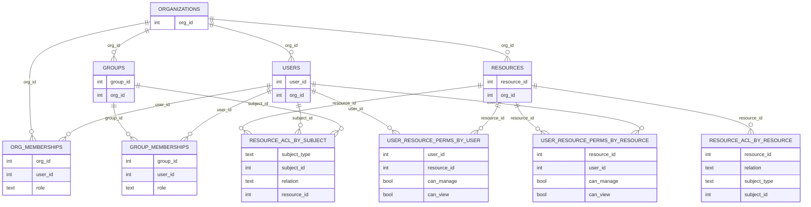

# Row-Level Permission Benchmark – Database Schema Overview

This document summarizes the logical data model used by your Go benchmarking project for Row Level Permission (RLP) across the different database engines. It focuses **only on relationship schemas**, not on program flow.

The core idea: you generate the same logical dataset from CSV files and then project it into different physical models depending on the engine.

---

## 0. Logical Schema (From `cmd/csv/load_data.go`)

Base CSVs and their logical tables:

* `organizations.csv` → `organizations(org_id)`
* `users.csv` → `users(user_id, org_id)`
* `groups.csv` → `groups(group_id, org_id)`
* `org_memberships.csv` → `org_memberships(org_id, user_id, role)`
* `group_memberships.csv` → `group_memberships(group_id, user_id, role)`
* `resources.csv` → `resources(resource_id, org_id)`
* `resource_acl.csv` → `resource_acl(resource_id, subject_type, subject_id, relation)`
* Closure / materialized permission tables (depending on engine):

  * `user_resource_perms` or `user_resource_perms_*` with `(user_id, resource_id, can_manage, can_view, …)`

Conceptually:

* An **organization** owns many users, groups, and resources.
* **Org membership** and **group membership** are bridge tables between users and organizations/groups.
* **Resource ACL** describes directed edges from a resource to subjects (users or groups) with a relation (e.g., manager, viewer).
* Some engines precompute **user-resource-permission closure** to accelerate checks and listings.

---

## 1. PostgreSQL & CockroachDB

PostgreSQL and CockroachDB share the same logical schema (same `schemas.sql`), only differing by the engine.

Key points:

* All users, groups, and resources are anchored to an organization.
* Org and group memberships are many-to-many via bridge tables.
* `resource_acl` is a Zanzibar-style edge table `(resource) -[relation]-> (user|group)`.

---

## 2. ScyllaDB

ScyllaDB keeps the same logical entities, but adds denormalized ACL and permission-closure tables tuned for specific access patterns (by resource and by subject).

Highlights in ScyllaDB:

* ACL is stored in two denormalized tables:

  * `resource_acl_by_resource`: partitioned by resource.
  * `resource_acl_by_subject`: partitioned by subject (user/group).
* Permissions closure is also stored two ways:

  * `user_resource_perms_by_user`: all resources for a given user.
  * `user_resource_perms_by_resource`: all users for a given resource.

This design is explicitly tuned for both "check" and "list" queries without joins.

---

## 3. MongoDB

MongoDB mirrors the CSV dataset closely, including a closure collection for user-resource permissions.

MongoDB is essentially a direct document-shaped translation of the relational model plus a closure collection.

---

## 4. ClickHouse

ClickHouse uses a relational-style schema with some denormalization and projections focused on analytics and high-speed scans.

Key detail: `org_id` is duplicated into `resource_acl` to support partitioning and efficient org-scoped queries.

---

## 5. Elasticsearch

Elasticsearch uses a single index with one document per resource. ACL and user closure are embedded inside the document.

Here:

* Each `ResourceDocument` embeds:

  * The resource metadata.
  * The ACL edges as nested documents.
  * The precomputed closure as arrays of user IDs per permission.

---

## 6. Authzed (PostgreSQL & CockroachDB Backends)

Authzed uses a **relation graph schema**, not explicit SQL tables. The storage engine may be PostgreSQL or CockroachDB, but the logical model is defined in `.zed` schema files.

In Authzed:

* Membership and ACL are all stored as relationships in a global authorization graph.
* Permissions (`manage`, `view`, `member`, `admin`, etc.) are **computed** from expressions over these relationships, not stored as explicit boolean columns.

---

## 7. Summary

* **PostgreSQL & CockroachDB**: classic relational model mirroring the CSVs, with ACL as an edge table.
* **MongoDB**: document model mirroring the relational structure, plus a dedicated closure collection.
* **ScyllaDB**: relational-ish entities but heavily denormalized around access patterns:

  * ACL by resource and by subject.
  * Permissions closure by user and by resource.
* **ClickHouse**: relational layout optimized for analytical scans, with org-scoped denormalization in ACL.
* **Elasticsearch**: single index, one document per resource, with nested ACL and flattened permission closure arrays.
* **Authzed**: authorization graph schema where users, groups, organizations, and resources are all objects, and permissions are expressions over relationships.

This gives you a clean, engine-by-engine view of how the same RLP problem is modeled at the data/schema level across your benchmark.
