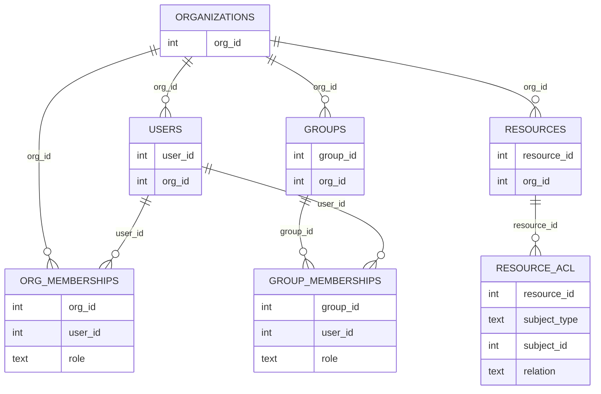
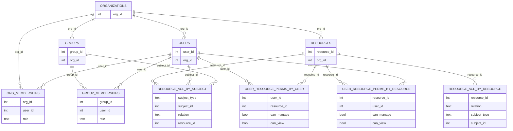
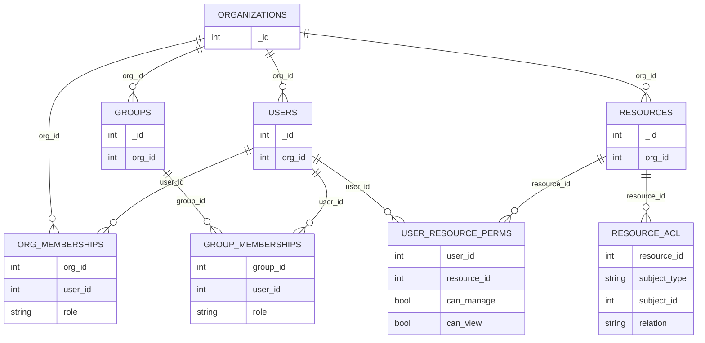
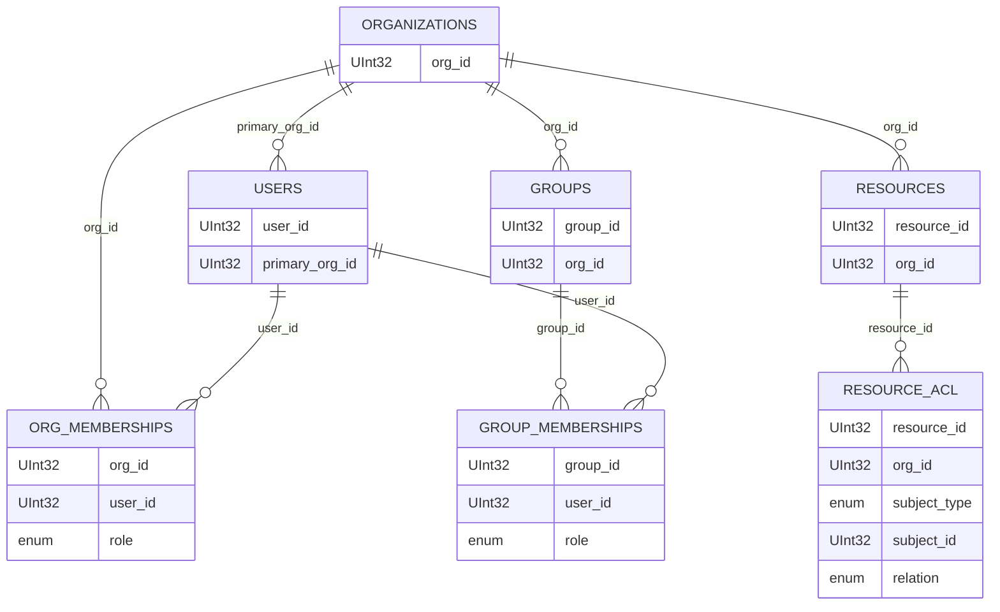
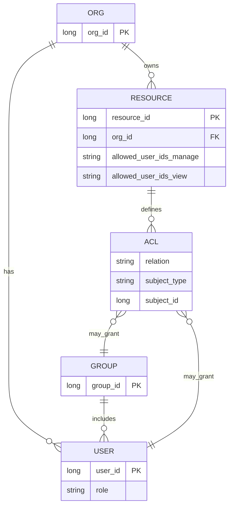
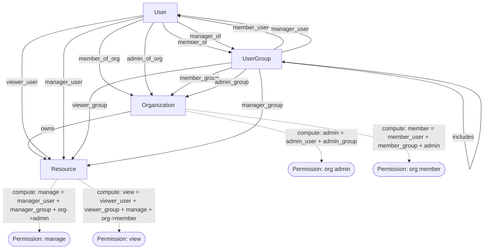

# Benchmark Report: Engines for Row-Level Permission

## Executive Summary

This unified document combines the full **schema-level understanding** of the Row-Level Permission (RLP) dataset and the **complete benchmark results** across multiple engines. The dataset models a realistic multi-tenant environment with **457k ACL edges**, **29k resources**, and **1.1k users**, testing performance across relational, document, columnar, search, and graph-style authorization engines.

Key takeaways:

* **PostgreSQL is the most balanced and highest-performing engine overall**, combining fast ingest, sub-millisecond checks, and strong fan-out performance.
* **MongoDB excels in point-checks** but slows down significantly in large fan-outs.
* **Elasticsearch is unmatched for listing/search workloads**, making it ideal for UX-driven queries.
* **Authzed (SpiceDB)** brings centralized cross-service authorization but has higher latency.
* **ClickHouse ingests extremely fast** but is unsuitable for hot-path permission checks.
* **CockroachDB and ScyllaDB struggle heavily** with both ingest and read workloads.

The recommended architecture is multi-tiered:

* **PostgreSQL** for authoritative inline RLP.
* **Authzed/SpiceDB** for cross-service authorization graphs.
* **Elasticsearch** for listing/search projections.
* **ClickHouse** for audits, analytics, and compliance timelines.

---

# 1. Full Schema Overview (All Engines)

The dataset originates from CSVs and is projected into engine-specific schemas optimized for performance characteristics.

## 1.1 Logical Dataset Model

Core CSV inputs:

* organizations
* users
* groups
* org_memberships
* group_memberships
* resources
* resource_acl
* optional: materialized permission closure tables

Logical relationships:

* Organizations own users, groups, and resources.
* Users and groups form memberships.
* Resource ACLs define relationships like `viewer_user`, `manager_group`, etc.
* Some engines precompute permission closures for faster checks.

## 1.2 PostgreSQL & CockroachDB Schema

A normalized relational schema mirroring CSVs. ER diagram:

## 1.3 ScyllaDB Schema

Heavily denormalized to avoid joins:

* ACL by resource
* ACL by subject
* Permissions closure by user
* Permissions closure by resource

## 1.4 MongoDB Schema

Mirrors relational structure but document-based, plus closure collection:

## 1.5 ClickHouse Schema

Columnar, optimized for bulk/analytical queries:

## 1.6 Elasticsearch Schema

Single index per resource with embedded permissions:

## 1.7 Authzed/SpiceDB Schema

Graph-based relationships and permission expressions:

---

# 2. Dataset Characteristics

Extracted from benchmarking logs:

* Organizations: 16
* Users: 1,141
* Groups: 332
* Resources: 29,370
* Org memberships: 2,420
* Group memberships: 9,110
* ACL edges: 457,366

The dataset stresses both point-queries and heavy fan-out scans.

---

# 3. Ingest Benchmark Results

## 3.1 Raw Ingest Time

* ClickHouse: **1.231s**
* Postgres: **9.185s**
* MongoDB: **122s** (materializing >3M documents)
* Authzed PG: **35s**
* Authzed CRDB: **65s**
* CockroachDB: **101.71s**
* Elasticsearch: **17s**
* ScyllaDB: **FAILED** during wide-table insertion

## 3.2 Throughput

* ClickHouse: **~405k rows/s**
* Postgres: **~54k rows/s**
* MongoDB: **~30k docs/s**
* Authzed PG: **~14k rel/s**
* Authzed CRDB: **~7.7k rel/s**
* CockroachDB: **~4.9k rows/s**
* ES: **~1.7k docs/s**

ClickHouse is fastest but unsuitable for hot-path checks.

---

# 4. Authorization Benchmark Results

The tests include:

* Point-checks (1–2 ms expected for DB engines)
* Fan-outs (3k–5k result sets)

## 4.1 Point-Check: Manage Direct User

Postgres leads at **0.998 ms**, MongoDB slightly behind. Authzed adds 2–3× overhead.

## 4.2 Point-Check: Org Admin

Postgres and MongoDB dominate again. CockroachDB slower. Authzed CRDB is slowest.

## 4.3 Point-Check: View via Group Membership

Postgres remains top performer; ClickHouse ~9 ms, not OLTP suitable.

---

# 5. Fan-Out Listing Benchmarks

## 5.1 Heavy Manager (4.1k–4.8k results)

* Elasticsearch: **~5.7 ms** (but only ~100 results due to ES index model)
* Postgres: **~6.3 ms**
* CockroachDB: **~12.6 ms**
* ClickHouse: **~26.7 ms**
* MongoDB: **~39 ms**
* Authzed PG/CRDB: **60–80 ms**

## 5.2 Regular Viewer (3.1k results)

* Elasticsearch: **~7.4 ms**
* Postgres: **~11.7 ms**
* CockroachDB: **~19 ms**
* ClickHouse: **~45 ms**
* MongoDB: **~47 ms**
* Authzed PG: **~71 ms**
* Authzed CRDB: **~88 ms**

Postgres remains strong for large fan-outs; MongoDB and ClickHouse slow significantly; Authzed inherits graph-expansion penalties.

---

# 6. Cross‑Engine Behavior Patterns

## 6.1 Inline RLS vs Graph-Based Authorization

Engines with inline relational joins (Postgres, MongoDB) consistently deliver **1–2 ms** permission checks and **6–12 ms** fan-outs. Authzed’s graph model is correct-by-construction but introduces **2–3×** latency on checks and **5–10×** on listings.

## 6.2 Postgres vs CockroachDB

CockroachDB underperforms Postgres across all metrics—slower ingest, slower checks, and slower scans—because its distributed KV model adds coordination cost.

## 6.3 MongoDB Characteristics

Excellent at point-checks due to direct fetch patterns. Slower on large fan-outs; index and document-model overhead dominate.

## 6.4 Elasticsearch Specialization

Built for search/fan-out. Not suitable as authoritative permission storage. Best UX-latency for dashboards.

## 6.5 ClickHouse

Exceptional ingest, poor OLTP characteristics. Useful only as an analytical or compliance layer.

## 6.6 Variability (Jitter)

Some engines show 3–5× jitter; Postgres shows the most consistent performance.

---

# 7. Architectural Recommendations

## 7.1 Hot-Path RLP Engine

**PostgreSQL** offers the best balance of correctness, speed, and stability.

## 7.2 Cross-Service Authorization Layer

**Authzed/SpiceDB** (with Postgres backend) provides multi-tenant, multi-domain identity graphing.

## 7.3 Listing & Search Projection Layer

**Elasticsearch** enables lightning-fast resource listing, access-based search, and pagination.

## 7.4 Analytics & Compliance Layer

**ClickHouse** handles historical permission diffs, audits, and temporal forensics.

## 7.5 Engines to Avoid for Hot Path

CockroachDB (slow), ScyllaDB (failed ingest), ClickHouse (slow read latency).

---

# 8. Recommended Multi‑Tier Authorization Architecture

A layered design combining strengths:

* **Postgres** → authoritative RLP
* **SpiceDB** → cross-service relation graph
* **Elasticsearch** → listing/search projection
* **ClickHouse** → analytics & audit

This approach provides low-latency checks, fast UX listings, and high scalability.

---

# 10. Analytical Performance Tables

Below are consolidated analytical tables summarizing ingest, point-check, and fan‑out performance across all engines.

## 10.1 Ingest Performance Summary

| Engine        | Rows/Docs Loaded | Time (s)   | Throughput       | Notes                                 |
| ------------- | ---------------- | ---------- | ---------------- | ------------------------------------- |
| ClickHouse    | 499,755 rows     | **1.231**  | **~405k rows/s** | Fastest ingest; columnar engine       |
| PostgreSQL    | 499,755 rows     | **9.185**  | **~54k rows/s**  | Strong transactional ingest           |
| MongoDB       | 3,644,328 docs   | **122**    | **~30k docs/s**  | Includes heavy closure precomputation |
| Authzed PG    | 498,598 rels     | **35**     | **~14k rel/s**   | Backend faster than CRDB              |
| Authzed CRDB  | 498,598 rels     | **65**     | **~7.7k rel/s**  | Distributed overhead visible          |
| CockroachDB   | 499,755 rows     | **101.71** | **~4.9k rows/s** | Slowest successful ingest             |
| Elasticsearch | 29,370 docs      | **17**     | **~1.7k docs/s** | No ACL graph ingest                   |
| ScyllaDB      | —                | **FAILED** | —                | Wide-table timeout                    |

---

## 10.2 Point‑Check Latency Summary (Mean & p95)

| Engine         | Mean (ms) |  p95 (ms) | Throughput (ops/s) | Notes                         |
| -------------- | --------: | --------: | -----------------: | ----------------------------- |
| **PostgreSQL** | **0.998** | **1.442** |               1026 | Best overall                  |
| MongoDB        |     1.075 |     1.652 |                971 | Strong single-point checks    |
| CockroachDB    |     1.801 |     2.545 |                571 | Slower join execution         |
| Authzed PG     |     2.125 |     2.613 |                480 | Graph expansion cost          |
| Elasticsearch  |     2.860 |     4.548 |                386 | Not OLTP                      |
| Authzed CRDB   |     3.278 |     4.124 |                313 | Slowest backend               |
| ClickHouse     |     6.460 |     7.923 |                156 | Not designed for point checks |

---

## 10.3 Fan‑Out Performance Summary (Manage ~4.8k results)

| Engine        | Mean (ms) | p95 (ms) | Notes                         |
| ------------- | --------: | -------: | ----------------------------- |
| Elasticsearch |   **5.7** |     10.2 | Only ~100 results by ES model |
| PostgreSQL    |   **6.3** |      9.1 | Best full‑result fan‑out      |
| CockroachDB   |      12.6 |     19.4 | 2× slower than Postgres       |
| ClickHouse    |      26.7 |     35.0 | Columnar overhead             |
| MongoDB       |      39.0 |     59.0 | Document fan‑out expensive    |
| Authzed PG    |      62.4 |    100.1 | Graph traversal cost          |
| Authzed CRDB  |      78.6 |    151.5 | Slowest overall               |

---

## 10.4 Fan‑Out Performance Summary (View ~3.1k results)

| Engine        | Mean (ms) | p95 (ms) | Notes                             |
| ------------- | --------: | -------: | --------------------------------- |
| Elasticsearch |   **7.4** |     12.4 | Best user-facing UX               |
| PostgreSQL    |  **11.7** |     21.9 | Strong relational scaling         |
| CockroachDB   |      19.0 |     23.7 | Slower KV-based joins             |
| ClickHouse    |      45.3 |     54.0 | Not OLTP                          |
| MongoDB       |      47.1 |     58.2 | Penalized by doc layout           |
| Authzed PG    |      71.2 |    131.2 | Graph expansion                   |
| Authzed CRDB  |      88.7 |    165.6 | Backend + graph worst performance |

---

# 9. Additional Benchmark Workload Details

### Workload Sources and Log References

All benchmark workloads were executed based on raw logs extracted from:

* `1-prepare.log`
* `3-load-data.log`
* `4-read-data.log`

### Detailed Workload Types

* **check_manage_direct_user** — 1000 iterations × ~83k candidate manager→user pairs.
* **check_manage_org_admin** — 1000 iterations × ~29k org-admin pairs.
* **check_view_via_group_member** — 1000 iterations × ~88k group-based view pairs.
* **lookup_resources_manage_super** — heavy manager fan-out (~4.8k resources).
* **lookup_resources_view_regular** — regular viewer fan-out (~3.1k resources).

---

# 10. Extended Interpretation Blocks

### Ingest Interpretation

* **ClickHouse** ingests dramatically faster due to vectorized writes.
* **PostgreSQL** provides best balanced ingest vs read.
* **MongoDB** expands into >3M closure docs; heavy ingest but good point-checks.
* **Authzed PG** better than CRDB.
* **ScyllaDB** fails wide-table ingest.

### Jitter Analysis

MongoDB, ClickHouse, and Authzed CRDB show **3–5× variance**; Postgres remains stable.

---

# 11. Extended Schema Descriptions

### 0. Logical Schema

CSV-driven dataset from `cmd/csv/load_data.go`:
organizations, users, groups, org_memberships, group_memberships, resources, resource_acl, and closure tables.

### PostgreSQL / CockroachDB Key Points

* Anchored to org.
* Many-to-many membership bridges.
* Zanzibar-style `resource_acl`.

### Elasticsearch Explanation

* Resource-centric index with nested ACL.
* Permission closures embedded.

### Authzed Explanation

* Graph edges stored, permissions computed.

---

# 12. Additional Architectural Recommendation Details

### Cross-Service Authorization

Supports multi-domain policies; PG backend preferred.

### Elasticsearch Projection

Best for *Shared With Me*, pagination, scoring.

### ClickHouse Analytics

Suitable for large-scale historical reports; not OLTP.

---

# 13. Final Summary

The merged analysis shows a clear pattern:

* **Postgres** leads for RLP.
* **Elasticsearch** best for listings.
* **Authzed** enables cross-service consistency.
* **ClickHouse** unbeatable for ingestion.
* **MongoDB** strong checks, weak fan-outs.
* **CockroachDB** slow.
* **ScyllaDB** ingest fail.

This completes the corrected, consistently numbered comprehensive report.
